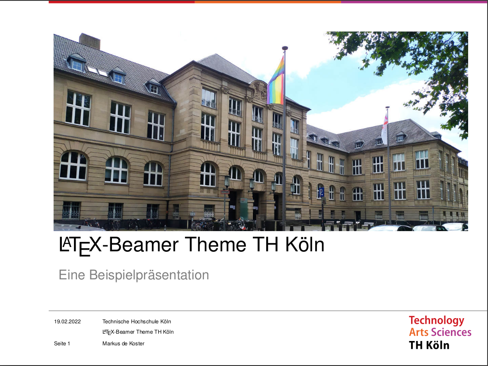
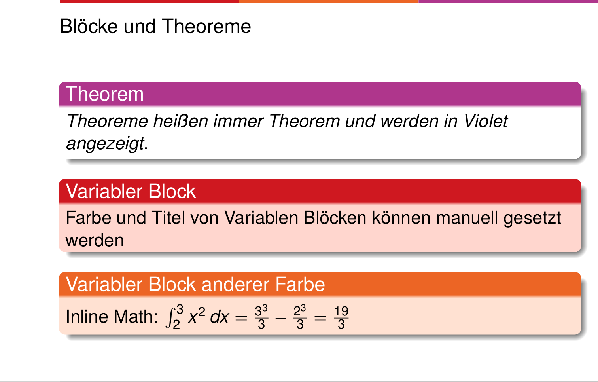

# LaTeX Beamer Presentations - TH Köln

LaTeX Beamer theme in design of TH Köln (Cologne University of Applied Sciences) for presentations

## Description

A theme for LaTeX beamer presentations in the design of cologne university of applied sciences (TH Köln).

You can insert your own images on the title page.
Setting the title, author etc. will automatically adjust this on every page.

All (or probably - most) elements try to use the university's color theme.

Check out the [example PDF](thk-example.pdf) fore more details!

For presenting I recommend a tool like [Pympress](https://github.com/Cimbali/pympress).

## Installation
- Depending on your engine, you might have to install additional packages manually e.g. pdftex.
- There are two options for including this theme in your presentation.

### Option 1 (preferable if you want git updates)
Simply clone the repository into a folder of your liking.
At the beginning of your TeX file include `\usepackage{/path/to/LaTeX-beamer-TH-Koeln/beamerthemethk}`
with either the relative or absolute path.

### Option 2 (system wide)
For a system wide installation of the theme, add the style files to your `texmf` tree.
More instructions e.g. on [Stackexchange](https://tex.stackexchange.com/questions/1137/where-do-i-place-my-own-sty-or-cls-files-to-make-them-available-to-all-my-te)

#### Ubuntu
Here is an explanation for Ubuntu using texlive
1. move the style files to`/usr/share/texlive/texmf-dist/tex/latex/beamerthemethk`
2. keep the figures folder in your working directory (i.e. where your `<mypresentation>.tex` file resides).
  - this might change in the future when I have figured out how to do it
3. Create an ls-R database `sudo mktexlsr`
  - it might be necessary to also update your texmf tree `sudo update-texmf`
5. `\usetheme{thk}` in your presentation file

## Why should I use LaTeX Beamer instead of Powerpoint?
- integration of **plots** (e.g. through `pgfplots`)
- support for all kinds of **math symbols**
- easy integration of **sources** through `BibTex`
- **cross platform**

Reasons to prefer Powerpoint:
- basically always if you don't need any of the features above
- no need to fiddle with code even if you only want to change a minor visual detail
- professional product with good support

## Usage
[Work in Progress] 
For now, please follow the [example TeX file](thk-example.tex).

## Contributing
You are encouraged to change the template to your preferences.
If you have general improvements or notice any errors you are welcome to open a pull request

## License
This project is covered by the [MIT License](https://opensource.org/licenses/mit-license.php).

### Logos and images
Usage of logos used in this project is subject to the [Creative Commons License](https://creativecommons.org/licenses/by-sa/4.0/deed.en) and may require permission by cologne university of applied sciences.

Author of the TH Köln logo: Marius Barzynski, Anna Fitz, Benedikt Schmitz, Andreas Wrede

Source: [Wikimedia](https://commons.wikimedia.org/wiki/File:TH_Koeln_Logo.svg)

The example image on the title page was taken by me (Markus de Koster) and may be used without restrictions.

## Tags
Präsentationsvorlage, Presentation, Präsentation, TH Köln, Powerpoint Alternative LaTeX
